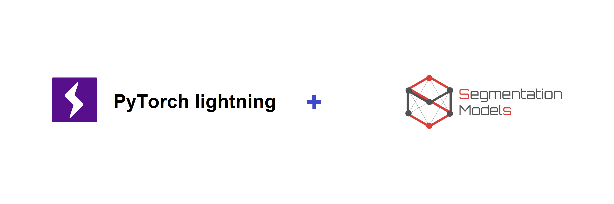

# Testing Mixed Precision Training Using Pytorch Lightning and Segmentation Models

<div align="center">
 


**Testing Mixed Precision Training Using [PyTorch Lightning](https://github.com/PytorchLightning/pytorch-lightning) and [Segmentation Models PyTorch](https://github.com/qubvel/segmentation_models.pytorch)**


  

</div>

Segmentation tasks are becoming easier day by day especially due to th rise in number of open source pachages like [Segmentation Models PyTorch](https://github.com/qubvel/segmentation_models.pytorch) . Similarly with the advent of mixed precision training, even beginners can train state of the art models on their PCs. In this project I have tried to experiment with fp16 training with the help of [PyTorch Lightning](https://github.com/PytorchLightning/pytorch-lightning) framework.

Pytorch lightning is a lightweight wrapper over pytorch and is used by researchers worldwide to speed up their Deep Learning experiments. You can use this project to set up your image segmentation project easily. The project structure is similar to the directory structure used in kaggle competitions so it will be easier to convert this project into a kaggle kernel.

# Requirements
- [PyTorch](https://pytorch.org/) (An open source deep learning platform)
- [PyTorch Lightning](https://github.com/PytorchLightning/pytorch-lightning) (A lightweight PyTorch wrapper for ML researchers)
- [Segmentation Models PyTorch](https://github.com/qubvel/segmentation_models.pytorch) (Python library with SOTA Networks for Image
Segmentation based on PyTorch)

# Table Of Contents
-  [In a Nutshell](#in-a-nutshell)
-  [Project Structure](#project-structure)
-  [Future Work](#future-work)
-  [Contributing](#contributing)
-  [Acknowledgments](#acknowledgments)

# In a Nutshell   
In a nutshell here's how to train your own segmentation model with [PyTorch Lightning](https://github.com/PytorchLightning/pytorch-lightning) and [Segmentation Models PyTorch](https://github.com/qubvel/segmentation_models.pytorch) , so **for example** assume you want to implement ResNet-34 to compete in [Carvana Image Masking Challenge](https://www.kaggle.com/c/carvana-image-masking-challenge/overview), so you should do the following:

- Create `/input` folder and place your dataset in it, edit `config.py` such that train and test paths point to their respective folders

```python
INPUT = 'input'
OUTPUT = 'output'

TRAIN_PATH = f'{INPUT}/train_hq'
MASK_PATH = f'{INPUT}/train_masks'
TEST_PATH = f'{INPUT}/test_hq'
```

- In `config.py`  file change the value of `MODEL_NAME` to the name of model that you wish to use, here we have used `smp_unet_resnet34` .

```python
MODEL_NAME = 'smp_unet_resnet34'
``` 
- In `model_dispatcher.py` file, you can build a dictionary named `build_model` to define your model using [Segmentation Models PyTorch](https://github.com/qubvel/segmentation_models.pytorch) library
```python
import segmentation_models_pytorch as smp

MODELS = {
    'smp_unet_resnet34' : smp.Unet('resnet34', encoder_weights='imagenet', classes=config.CLASSES, activation='softmax'),
}
```

- In `dataset.py` file create a `Dataset Object` like this

```python
class CarvanaDataset:
    def __init__(self, folds):
        df = pd.read_csv(config.TRAIN_FOLDS)
        df = df[['img', 'kfold']]
        df = df[df.kfold.isin(folds)].reset_index(drop=True)
        self.image_ids = df.img.values

        if len(folds) == 1:
            self.aug = A.Compose([
                A.Resize(config.CROP_SIZE, config.CROP_SIZE, always_apply=True),
                A.Normalize(config.MODEL_MEAN, config.MODEL_STD, always_apply=True)
            ])
        else:
            self.aug = A.Compose([
                A.Resize(config.CROP_SIZE, config.CROP_SIZE, always_apply=True),
                A.ShiftScaleRotate(
                    shift_limit=0.0625,
                    scale_limit=0.1,
                    rotate_limit=15,
                    p=0.9),
                A.Normalize(config.MODEL_MEAN, config.MODEL_STD, always_apply=True)
            ])
        

    def __len__(self):
        return len(self.image_ids)

    def __getitem__(self, item):
        img_name = self.image_ids[item]
        image = np.array(Image.open(f'{config.TRAIN_PATH}/{img_name}.jpg'))
        mask = np.array(Image.open(f'{config.MASK_PATH}/{img_name}_mask.gif'))

        augmented = self.aug(image=image, mask=mask)

        image = augmented['image']
        mask = augmented['mask']

        image = np.transpose(image, (2, 0, 1)).astype(np.float32)

        return {
            'image': torch.tensor(image, dtype=torch.float),
            'mask': torch.tensor(mask, dtype=torch.float)
        }


```

- Now, run `folds.py` to create folds for training and validation. You can test your dataset using `test_dataset.py`.


- Now we can build our `Lightning Module` :- 
```python
import pytorch_lightning as pl
import model_dispatcher
import config
from dataset import CarvanaDataset

class CarvanaModel(pl.LightningModule):
    def __init__(self, train_folds, val_folds):
        super(CarvanaModel, self).__init__()
        # import model from model dispatcher
        self.model = model_dispatcher.MODELS[config.MODEL_NAME]
        self.train_folds = train_folds
        self.val_folds = val_folds

    def forward(self, x):
        return self.model(x)

    def training_step(self, batch, batch_nb):
        # REQUIRED

        x = batch['image']
        y = batch['mask']
        y_hat = self(x)
        loss = IoULoss()(y_hat, y)
        tensorboard_logs = {'train_loss': loss}
        return {'loss': loss, 'log': tensorboard_logs}

    def validation_step(self, batch, batch_nb):
        # OPTIONAL
        x = batch['image']
        y = batch['mask']
        y_hat = self(x)
        return {'val_loss': IoULoss()(y_hat, y)}

    def validation_epoch_end(self, outputs):
        # OPTIONAL
        avg_loss = torch.stack([x['val_loss'] for x in outputs]).mean()
        tensorboard_logs = {'val_loss': avg_loss}
        return {'val_loss': avg_loss, 'log': tensorboard_logs}

    def configure_optimizers(self):
        return torch.optim.Adam(self.parameters(), lr=config.LR)


    def train_dataloader(self):
        # REQUIRED
        return DataLoader(CarvanaDataset(folds=self.train_folds), shuffle=True, batch_size=config.TRAIN_BATCH_SIZE)

    def val_dataloader(self):
        # OPTIONAL
        return DataLoader(CarvanaDataset(folds=self.val_folds), batch_size=config.VAL_BATCH_SIZE)
```

- Now we can train our model using the `Lightning_trainer.py` script

```python
carvana_model = CarvanaModel(train_folds, val_folds)

# most basic trainer, uses good defaults (1 gpu)
trainer = pl.Trainer(gpus=1, accumulate_grad_batches=64, amp_level='O1', precision=16, profiler=True, max_epochs=config.EPOCHS)
trainer.fit(carvana_model)

```

**Note: We have used amp to perform Mixed Precision Training using NVIDIA APEX library**


# Project Structure
```
├──  input
│    ├── test_hq  - here's the folder containing test images.
│    ├── train_hq  - here's the folder containing train images.
│    └── train_masks  - here's the folder containing train masks.
│
│
├──  lightning_logs  
│    └── version_#  - training checkpoints are saved here.
│ 
│
├──  output  
│    └── train_folds.py  - this file is generated when we run folds.py.
│    
│
└──  src
    ├── config.py     - this file contains all the hyperparameters for the project.
    ├── dataset.py     - this file contains dataset object.
    ├── decoders.py     - redundant file will be used in future.
    ├── dice_loss.py     - this file defines various losses which can be used to train the model.
    ├── encoders.py     - redundant file will be used in future.
    ├── folds.py     - this file created folds for cross validation.
    ├── Lightning_module.py     - this file contains the Lightinig Module.
    ├── Lightning_tester.py     - this file is used to evaluate the trained model.
    ├── model_dispatcher.py     - this file contains model definitions.
    ├── ND_Crossentropy.py     - helper function for loss function.
    ├── test_dataset.py     - this file contains the train loops.
    └── test_model.py   - this file contains the inference process.

```


# Future Work
- Write Unetify script using encoder.py and decoder.py
- Add Augmentations to the dataset to make the model more robust

# Contributing
Any kind of enhancement or contribution is welcomed.


# Acknowledgments

- [SegLoss](https://github.com/JunMa11/SegLoss) used losss functions from this repo


